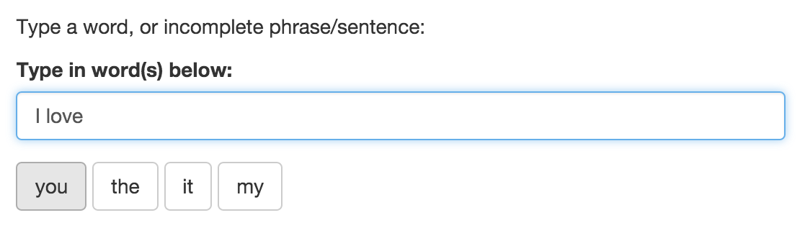
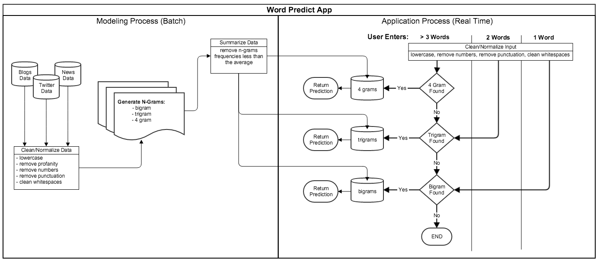

Data Science Capstone Project
========================================================
author: Luis Manuel Murillo Reyna
date: June, 2019

Objective
========================================================

The Coursera Data Science Specialization project (sponsored by SwiftKey) is to create an application that predicts the next word in a phrase/sentence. Such an application would be very useful for a keyboard on a mobile device that helps a user type faster by anticipating what the next word would be. 

On the following slides, I will explain the details of the application created to fulfill the objective. We will go over:

- Overview of the Application
- Technical and Statistical Architecture
- Future Possibilities
- Conclusion and Appendix

The Application
========================================================

The Word Predict App (https://lmurillo.shinyapps.io/DataScienceCapstone1/) is simple and easy to use, yet powerful!

Simply start typing on the text field and up to 4 possible next words will automatically display below the field. Each predicted word is clickable and clicking on the desired word will add it to your phrase and predict the next word.

Technical and Statistical Architecture
========================================================
<small>The application uses text documents collected from blogs, news articles, and twitter to statistically model language patterns. [N-Grams](https://en.wikipedia.org/wiki/N-gram), [Markov Model] (https://en.wikipedia.org/wiki/Markov_model) and [Katz's back-off model] (https://en.wikipedia.org/wiki/Katz%27s_back-off_model) were used to predict the next word. The modeling process used a large set of data so it was batched. The batch process created a much smaller set of data to be used in the application for fast real-time performance.  The diagram below show the architecture of the application:</small>

Future Possibilities 
========================================================
This project only scratches the surface of natural language processing and predictive analytics applications. There are many possibilities for improvement including:
- Parts of speech tagging to better understand the context of the user's words
- More data sources (such as books and Reuters Corpus Vol. 1)
- Parallel processing of data to increase volume and speed
- Feedback loop into the model (e.g., learn from what predictions users accept)

Conclusion and Appendix
========================================================
I found this project and the Data Science Program to be very enjoyable! I learned quite a bit and had fun doing it.

For this project, here is a list of resources:

- [Github repository for the project] (https://github.com/lmurillo80/CapstoneProject)
- [Milestone report for the project](http://rpubs.com/lmurillo/508162)
- [Coursera course on NLP](https://www.coursera.org/course/nlp)
- [Text Mining Infrastructure in R](http://www.jstatsoft.org/v25/i05/)
- [Basic Text Mining in R](https://rstudio-pubs-static.s3.amazonaws.com/31867_8236987cf0a8444e962ccd2aec46d9c3.html)
- [tm Package in R](https://cran.r-project.org/web/packages/tm/tm.pdf)
- [Shiny Tutorial] (http://shiny.rstudio.com/tutorial/)
- [N-Grams](https://en.wikipedia.org/wiki/N-gram)
